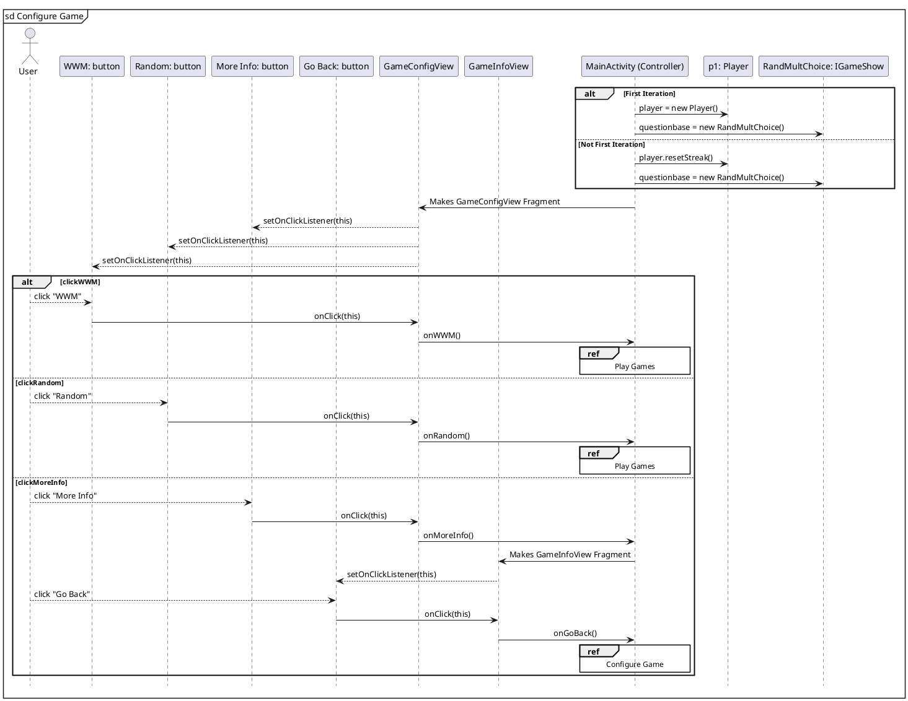
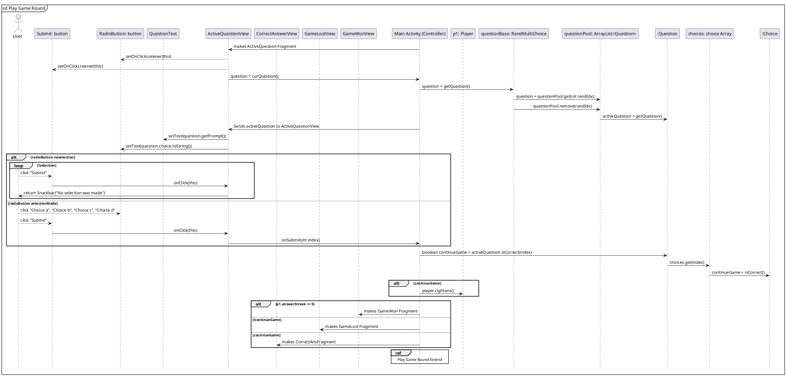
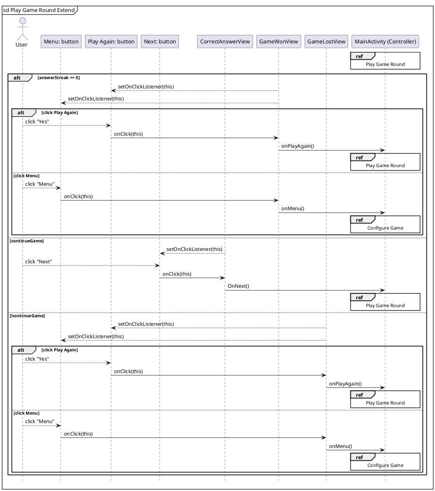

```plantuml
title Class Diagram
' classes
'skinparam classAttributeIconSize 0


class MainActivity{
   -mainView: IMainView
   -player: Player
   -activeQuestion: Question
   -questionBase: IGameShow
   -continueGame: boolean
--
   # onCreate(Bundle savedInstanceState): void
   + resetGame(): void
   + getQuestion(): Question
   + rightAnswer(): Choice
   + questionNumber(): int
   + onWWM(): void
   + onRandom(): void
   + onMoreInfo(): void
   + onPlayAgain(): void
   + onMenu(): void
   + onNext(): void
   + onGoBack(): void
   + onSubmit(int index): void
}
class Question{
   -prompt: String
   -difficulty: String
   -category: String
   -questionType: String
   -choices: array[Choice]
   --
   +toString(): String
   +isCorrect(int selection): boolean
   +getPrompt(): String
   +getChoice(int i): Choice
   +getCorrectChoice(): Choice
}
class Choice{
   -name : String
   -isCorrect: boolean
   --
   +toString(): String
   +getCorrect(): boolean
}
class Player{
-name: String
-wins: int
-answerStreak: int
-questionNumber: int
--
+rightAns(): void
+resetStreak(): void
}
interface IGameShow{
--
getQuestion(): Question
}
MainActivity "1" ---left-- "*" Question : "                         are-contained-in                        "
Question "\t1" -left-->"(1..*)" Choice:a component of
MainActivity "1\t" --right-- "1..*" Player: "      requires         "
MainActivity "1 " --down-- " 1 " IGameShow: " is-described-by"
class RandMultiChoice{
   -questionPool: ArrayList<Question>
   --
   +getQuestion()
}
IGameShow"\t   1\n\n\n\n" <|..left.."1\t" RandMultiChoice:" \t\t            is-formatted-by     \t\t\t                    "
RandMultiChoice "1 "--up-- " * " Question: " are-contained-in"
class ActiveQuestionFrag{
private binding: FragmentActiveQuestionBinding
private listener: Listener
--
+onCreateView(inflater, container, savedInstanceState): View
+onViewCreated(view, savedInstanceState): void
+numQuestion(): int
+curQuestion(): Question
}
class CorrectAnsFragment{
private binding: FragmentCorrectAnsBinding
private listener: Listener
--
+onCreateView(inflater, container, savedInstanceState): View
+onViewCreated(view, savedInstanceState): void
}
class GameLostFragment{
private binding: FragmentGameLostBinding
private listener: Listener
--
+onCreateView(inflater, container, savedInstanceState): View
+onViewCreated(view, savedInstanceState): void
+correctAnswerChoice(): Choice
}
class GameModeFragment{
private binding: FragmentGameModeBinding
private listener: Listener
--
+onCreateView(inflater, container, savedInstanceState): View
+onViewCreated(view, savedInstanceState): void
}
class GameWonFragment{
private binding: FragmentGameWonBinding
private listener: Listener
--
+onCreateView(inflater, container, savedInstanceState): View
+onViewCreated(view, savedInstanceState): void
}
class GameConfigFragment{
private binding: FragmentGameConfigBinding
private listener: Listener
--
+onCreateView(inflater, container, savedInstanceState): View
+onViewCreated(view, savedInstanceState): void
}
interface IActiveQuestionView{
   interface Listener{
       onSubmit(int index): void
       questionNumber(): int
       getQuestion(): Question
}
interface ICorrectAnsView{
   interface Listener{
       onNext(): void
}
interface IGameLostView{
   interface Listener{
       onPlayAgain(): void
       onMenu(): void
       rightAnswer(): Choice
}
interface IGameModeView{
   interface Listener{
       onGoBack(): void
}
interface IGameWonView{
   interface Listener{
       onPlayAgain(): void
       onMenu(): void
}
interface IGameConfigView{
   interface Listener{
       onWWM(): void
       onRandom(): void
       onMoreInfo(): void
}
interface IMainView{
--
+getRootView(): View
+displayFragment(fragment, reversible, name): void
}
class MainView{
fmanager: FragmentManager
binding: ActivityMainBinding
--
+getRootView(): View
+displayFragment(fragment, reversible, name): void
}
IMainView"1" .up.|> "1  "MainView: "Implemented-by"
IGameConfigView"1" .down.|> "1  "GameConfigFragment: "implements"
IGameWonView"1" .down.|> "1  "GameWonFragment: "implements"
IGameModeView"1" .down.|> "1  "GameModeFragment: "implements"
IGameLostView"1" .down.|> "1  "GameLostFragment: "implements"
ICorrectAnsView"1" .down.|> "1  "CorrectAnsFragment: "implements"
IActiveQuestionView"1" .down.|> "1  "ActiveQuestionFrag: "implements"
MainActivity"1" -up- "*"GameConfigFragment: "created-by"
MainActivity"1" -up- "*"CorrectAnsFragment: "created-by"
MainActivity"1" -up- "*"ActiveQuestionFrag: "created-by"
MainActivity"1" -up- "*"GameLostFragment: "created-by"
MainActivity"1" -up- "*"GameWonFragment: "created-by"
MainActivity"1" -up- "*"GameModeFragment: "created-by"
MainActivity"1" <|.up. "1"IGameConfigView : "listener implements"
MainActivity"1" <|.up. "1"IGameWonView: "listener implements"
MainActivity"1" <|.up. "1"IGameModeView: "listener implements"
MainActivity"1" <|.up. "1"IGameLostView: "listener implements"
MainActivity"1" <|.up. "1"ICorrectAnsView: "listener implements"
MainActivity"1" <|.up. "1"IActiveQuestionView: "listener implements"
MainActivity"1" -- "1"MainView: takes in


```








