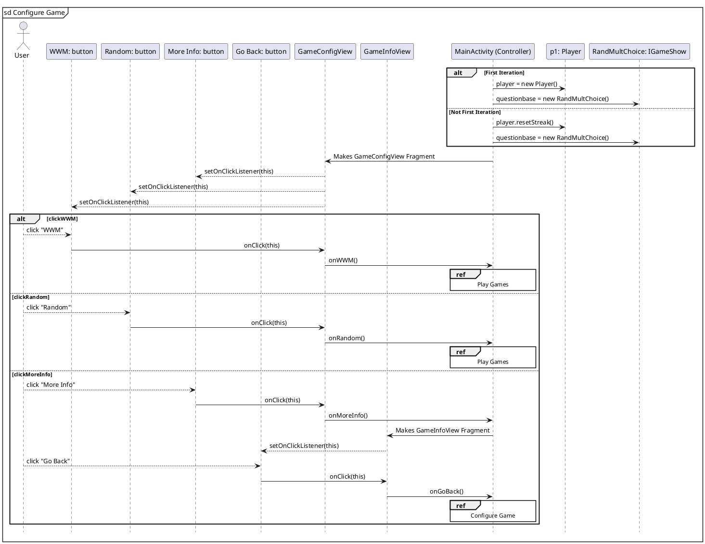
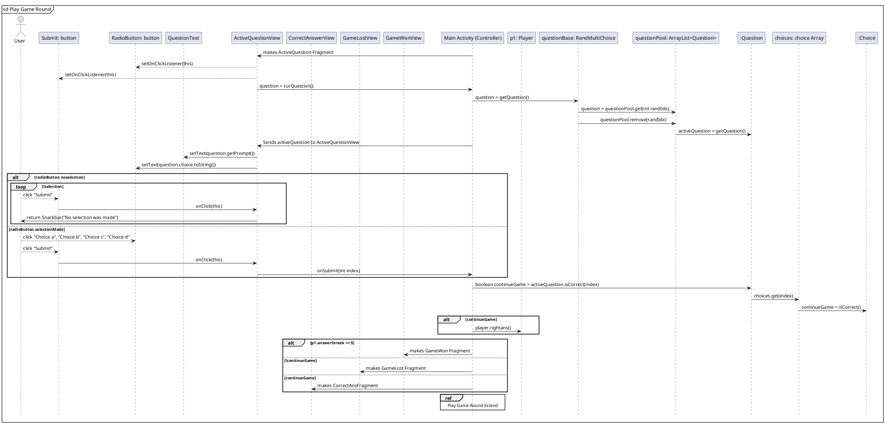
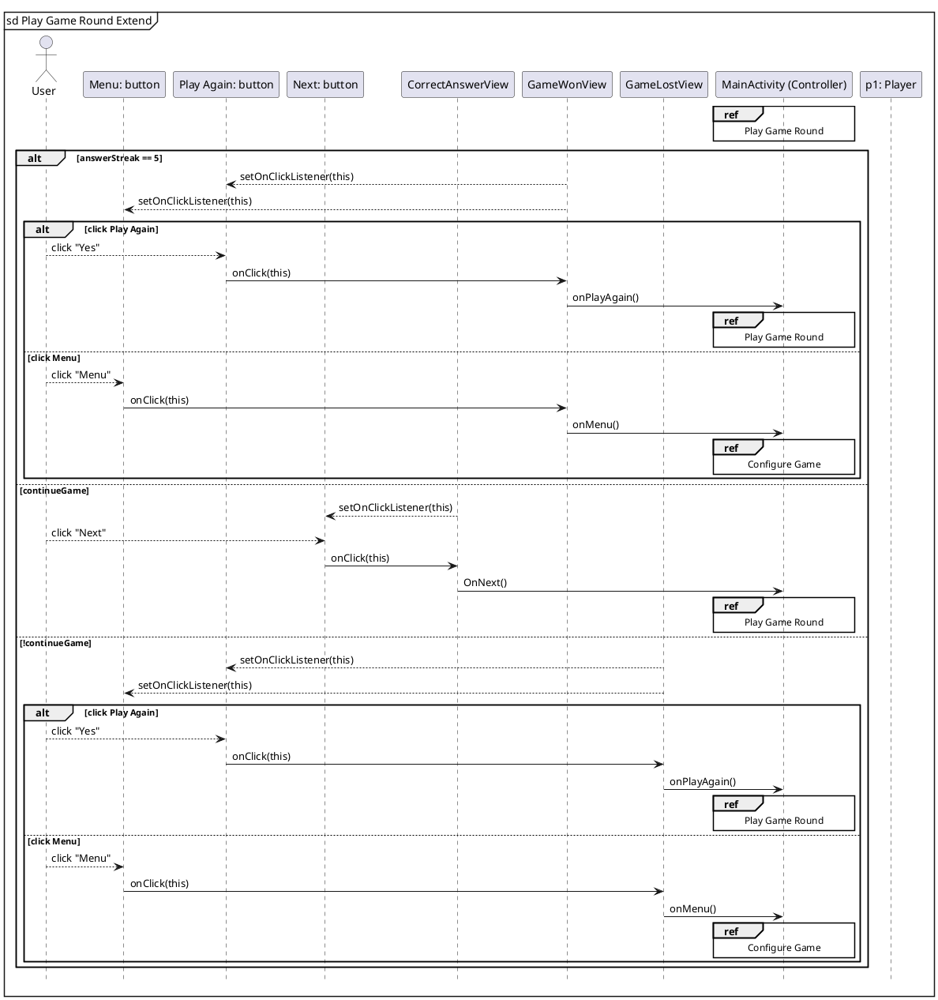

```plantuml
@startuml
hide footbox
mainFrame sd Configure Game
actor us as "User"
participant wwmb as "WWM: button"
participant rand as "Random: button"
participant ginfo as "More Info: button"
participant gback as "Go Back: button"
participant GCV as "GameConfigView"
participant MIV as "GameInfoView"
participant clr as "MainActivity (Controller)"
participant p1 as "p1: Player"
participant gs as "RandMultChoice: IGameShow"
alt First Iteration
clr -> p1 :player = new Player()
clr -> gs: questionbase = new RandMultChoice()
else Not First Iteration
clr -> p1: player.resetStreak()
clr -> gs: questionbase = new RandMultChoice()
end
clr -> GCV: Makes GameConfigView Fragment
GCV --> ginfo: setOnClickListener(this)
GCV --> rand: setOnClickListener(this)
GCV --> wwmb: setOnClickListener(this)
alt clickWWM
us --> wwmb: click "WWM"
wwmb -> GCV: \t\t\t\t\t\t\t\t\t\t\t\t\tonClick(this)
GCV -> clr: onWWM()
ref over clr
Play Games
end
else  clickRandom
us --> rand: click "Random"
rand -> GCV: \t\t\t\t\t\t\t\t\tonClick(this)
GCV -> clr: onRandom()
ref over clr
Play Games
end
else clickMoreInfo
us --> ginfo: click "More Info"
ginfo -> GCV: \t\t\t\t\tonClick(this)
GCV -> clr: onMoreInfo()
clr -> MIV: Makes GameInfoView Fragment
MIV --> gback:setOnClickListener(this)
us --> gback: click "Go Back"
gback -> MIV: \t\t\t\t\tonClick(this)
MIV -> clr:\t\t\tonGoBack()
ref over clr
Configure Game
end
end
@endUML
```

```plantuml
@startuml
hide footbox
mainFrame sd Play Game Round
actor us as "User"
participant sub as "Submit: button"
participant rdb as "RadioButton: button"
participant qtv as "QuestionText"
participant AQV as "ActiveQuestionView"
participant RAV as "CorrectAnswerView"
participant GLV as "GameLostView"
participant GWV as "GameWonView"
participant clr as "Main Activity (Controller)"
participant p1 as "p1: Player"
participant GS as "questionBase: RandMultiChoice"
participant QP as "questionPool: ArrayList<Question>"
participant QST as ":Question"
participant CA as "choices: choice Array"
participant CHC as ":Choice"
clr -> AQV: makes ActiveQuestion Fragment
AQV --> rdb: setOnClickListener(this)
AQV --> sub: setOnClickListener(this)
AQV -> clr: question = curQuestion();
clr -> GS: question = getQuestion()
GS -> QP: question = questionPool.get(int randIdx);
GS -> QP: \t\tquestionPool.remove(randIdx)
QP -> QST: activeQuestion = getQuestion()
clr -> AQV: Sends activeQuestion to ActiveQuestionView
AQV -> qtv: setText(question.getPrompt())
AQV -> rdb: setText(question.choice.toString())
alt radioButton noselection
loop !selection
us --> sub: click "Submit"
sub -> AQV: \t\t\t\t\t\t\t\t\t\t\t\t\t\tonClick(this)
AQV -> us: return Snackbar("No selection was made")
end
else radioButton.selectionMade
us --> rdb: click "Choice a", "Choice b", "Choice c", "Choice d"
us --> sub: click "Submit"
sub -> AQV: \t\t\t\t\t\t\t\t\t\t\t\t\t\tonClick(this)
AQV -> clr: \t\t\t\t\t\tonSubmit(int index)
end
clr -> QST: boolean continueGame = activeQuestion.isCorrect(index)
QST -> CA: choices.get(index)
CA -> CHC: continueGame = isCorrect()
alt continueGame
clr -> p1: player.rightans()
end
alt p1.answerStreak == 5
clr -> GWV: makes GameWon Fragment
else !continueGame
clr -> GLV: makes GameLost Fragment
else continueGame
clr -> RAV: makes CorrectAnsFragment
end
ref over clr
Play Game Round Extend
end
@enduml
```

```plantuml
@startuml
hide footbox
mainFrame sd Play Game Round Extend
actor us as "User"
participant MU as "Menu: button"
participant PA as "Play Again: button"
participant NB as "Next: button"
participant RAV as "CorrectAnswerView"
participant GWV as "GameWonView"
participant GLV as "GameLostView"
participant CLR as "MainActivity (Controller)"
participant P1 as "p1: Player"


ref over CLR
Play Game Round
end


alt answerStreak == 5
GWV --> PA: setOnClickListener(this)
GWV --> MU: setOnClickListener(this)
alt click Play Again
us --> PA: click "Yes"
PA -> GWV: onClick(this)
GWV -> CLR: onPlayAgain()
ref over CLR
Play Game Round
end
else click Menu
us --> MU: click "Menu"
MU -> GWV: onClick(this)
GWV -> CLR: onMenu()
ref over CLR
Configure Game
end
end
else continueGame
RAV --> NB: setOnClickListener(this)
us --> NB: click "Next"
NB -> RAV: onClick(this)
RAV -> CLR: OnNext()
ref over CLR
Play Game Round
end
else !continueGame
GLV --> PA: setOnClickListener(this)
GLV --> MU: setOnClickListener(this)
alt click Play Again
us --> PA: click "Yes"
PA -> GLV: onClick(this)
GLV -> CLR: onPlayAgain()
ref over CLR
Play Game Round
end
else click Menu
us --> MU: click "Menu"
MU -> GLV: onClick(this)
GLV -> CLR: onMenu()
ref over CLR
Configure Game
end
end
end
@enduml
```
