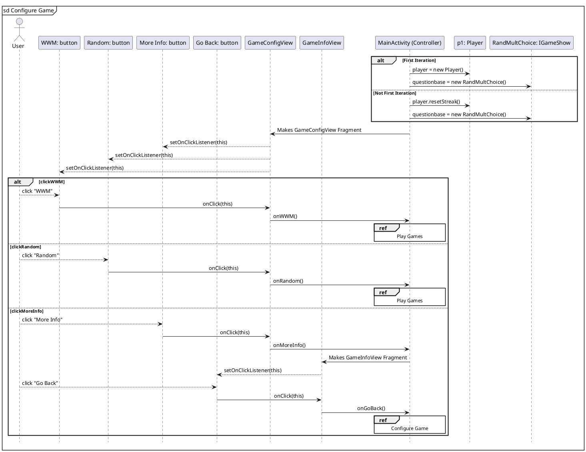
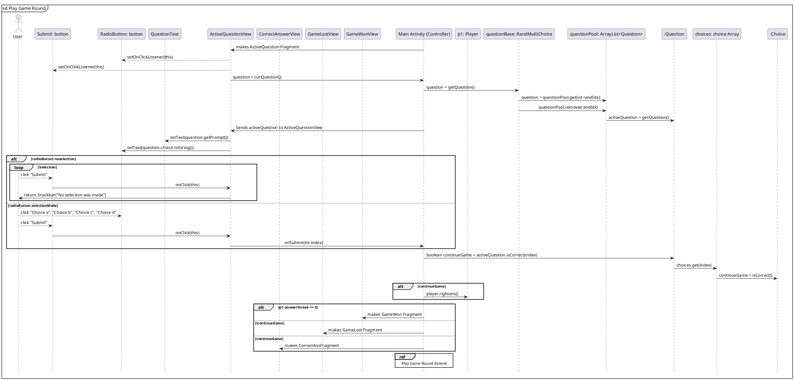
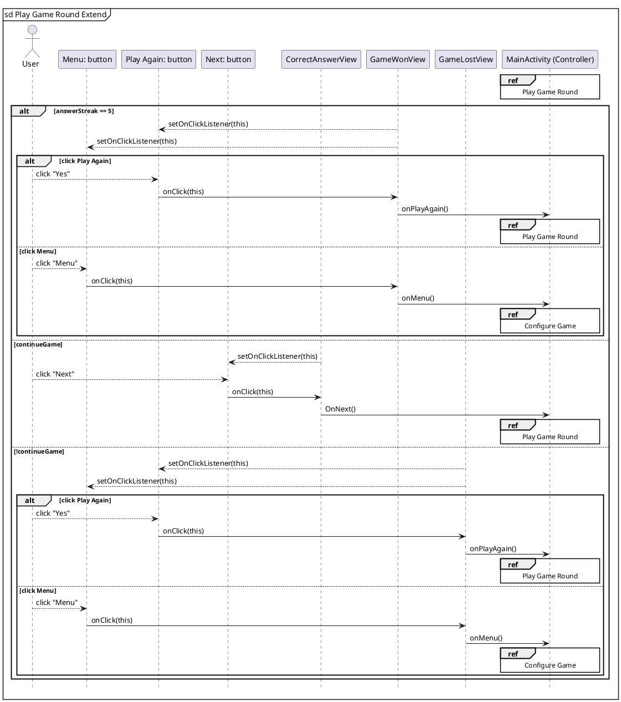

```plantuml
title Class Diagram
' classes
'skinparam classAttributeIconSize 0


class MainActivity{
  -PLAYER: String
  -AQUESTION: String
  -mainView: IMainView
  -player: Player
  -activeQuestion: Question
  -questionBase: IGameShow
  -persistenceFacade: IPersistenceFacade
  -continueGame: boolean
  -curCategory: String
  -curMode: String
  -bestCategory: String
  -bestMode: String
--
  # onCreate(Bundle savedInstanceState): void
  # onSavedInstanceState(Bundle outstate): void
  + onPlayerReceived(Player player): void
  + onDatabaseReceived(IGameShow database): void
  + resetGame(): void
  + getActiveQuestion(): Question
  + getQuestion(): Question
  + rightAnswer(): Choice
  + questionNumber(): int
  + getCategory(): String
  + getBestCategory(): String
  + getBestMode(): String
  + getNumberWins(): String
  + getNumberQuestionsCorrect(): String
  + onStats(): void
  + onWWM(): void
  + onCategoriesMode(): void
  + onGeo(): void
  + onTV(): void
  + onHobbies(): void
  + onSports(): void
  + onRandom(): void
  + onRandomCat(): void
  + onTrivialPursuit(): void
  + onMoreInfo(): void
  + onPlayAgain(): void
  + onMenu(): void
  + onNext(): void
  + onGoBack(): void
  + onSubmit(int index): void
}
class Question{
  -prompt: String
  -category: String
  -choices: List<Choice>
  --
  +toString(): String
  +isCorrect(int selection): boolean
  +getPrompt(): String
  +getCategory(): String
  +getChoice(int i): Choice
  +getCorrectChoiceInd(): int
  +getCorrectChoice(): Choice
}
class Choice{
  -name : String
  -isCorrect: boolean
  --
  +toString(): String
  +getCorrect(): boolean
}
class Player{
-name: String
-wins: int
+answerStreak: int
+questionNumber: int
+totalQuestionsCorrect: int
+ totalWins: int
+ categoryScores: Map<String, Integer>
+ modeScores: Map<String, Integer>
--
+rightAns(): void
+addWin(): void
+resetStreak(): void
+addCategoryWin(category): void
+addModeWin(mode):void
+getName(): String
+getWins(): int


}
interface IGameShow{
--
getQuestion(): Question
}


MainActivity "1" ---left-- "*" Question : "                         are-contained-in                        "
Question "\t1" -left-->"(1..*)" Choice:a component of
MainActivity "1\t" --right-- "1..*" Player: "      requires         "
MainActivity "1 " --down-- " 1 " IGameShow: " is-described-by"
class RandMultiChoice{
  -questionPool: ArrayList<Question>
  --
  +getQuestion()
}
IGameShow"\t   1\n\n\n\n" <|..left.."1\t" RandMultiChoice:" \t\t            is-formatted-by     \t\t\t                    "
RandMultiChoice "1 "--up-- " * " Question: " are-contained-in"
class ActiveQuestionFrag{
- binding: FragmentActiveQuestionBinding
- listener: Listener
--
+onCreateView(inflater, container, savedInstanceState): View
+onViewCreated(view, savedInstanceState): void
+numQuestion(): int
+curQuestion(): Question
}
class CorrectAnsFragment{
- binding: FragmentCorrectAnsBinding
- listener: Listener
--
+onCreateView(inflater, container, savedInstanceState): View
+onViewCreated(view, savedInstanceState): void
}
class GameLostFragment{
- binding: FragmentGameLostBinding
- listener: Listener
--
+onCreateView(inflater, container, savedInstanceState): View
+onViewCreated(view, savedInstanceState): void
+correctAnswerChoice(): Choice
}
class GameModeFragment{
- binding: FragmentGameModeBinding
- listener: Listener
--
+onCreateView(inflater, container, savedInstanceState): View
+onViewCreated(view, savedInstanceState): void
}
class GameWonFragment{
- binding: FragmentGameWonBinding
- listener: Listener
--
+onCreateView(inflater, container, savedInstanceState): View
+onViewCreated(view, savedInstanceState): void
}
class GameConfigFragment{
- binding: FragmentGameConfigBinding
- listener: Listener
--
+onCreateView(inflater, container, savedInstanceState): View
+onViewCreated(view, savedInstanceState): void
+topCategory(): String
}
interface IActiveQuestionView{
}
interface IActiveQuestionView.Listener{
--
      onSubmit(int index): void
      questionNumber(): int
      getQuestion(): Question
      getCategory(): String
      getActiveQuestion(): Question
}


interface ICorrectAnsView{


}


interface ICorrectAnsView.Listener{
--
   onNext(): void
}


interface IGameLostView{


}
interface IGameLostView.Listener{
--
      onPlayAgain(): void
      onMenu(): void
      rightAnswer(): Choice
}


interface IGameModeView{


}
interface IGameModeView.Listener{
--
   onGoBack(): void
}


interface IGameWonView{


}
interface IGameWonView.Listener{
--
      onPlayAgain(): void
      onMenu(): void
}


interface IGameConfigView{


}
interface IGameConfigView.Listener{
--
      onWWM(): void
      onRandom(): void
      onMoreInfo(): void
      onCategoriesMode(): void
      onTrivialPursuit(): void
      getBestCategory(): String
}


interface IMainView{
--
+getRootView(): View
+displayFragment(fragment, reversible, name): void
}
interface ICategoriesModeView{
}
interface ICategoriesModeView.Listener{
--
onGeo(): void
onTV(): void
onHobbies(): void
onSports(): void
onRandomCat(): void
onGoBack(): void
}
class CategoriesModeFragment{
- binding: FragmentCategoriesModeBinding
- listener: Listener
--
+onCreateView(inflater, container, savedInstanceState): View
+onViewCreated(view, savedInstanceState): void
}
class MainView{
fmanager: FragmentManager
binding: ActivityMainBinding
--
+getRootView(): View
+displayFragment(fragment, reversible, name): void
}


class TriviaTimeFragFactory{
- VIEW_PACKAGE: String
- controller: MainActivity
--
+instantiate(classLoader, className): Fragment
}
TriviaTimeFragFactory"1" -right- "1"MainActivity: "allows screen rotations for"
ICategoriesModeView "1" <|.down. "1 "CategoriesModeFragment: "implented-by"
IMainView"1" <|.up. "1  "MainView: "implements"
IGameConfigView"1" <|.down. "1  "GameConfigFragment: "implented-by"
IGameWonView"1" <|.down. "1  "GameWonFragment: "implented-by"
IGameModeView"1" <|.down. "1  "GameModeFragment: "implented-by"
IGameLostView"1" <|.down. "1  "GameLostFragment: "implented-by"
ICorrectAnsView"1" <|.down. "1  "CorrectAnsFragment: "implented-by"
IActiveQuestionView"1" <|.down. "1  "ActiveQuestionFrag: "implented-by"
MainActivity"1" -up- "*"GameConfigFragment: "created-by"
MainActivity"1" -up- "*"CorrectAnsFragment: "created-by"
MainActivity"1" -up- "*"ActiveQuestionFrag: "created-by"
MainActivity"1" -up- "*"GameLostFragment: "created-by"
MainActivity"1" -up- "*"GameWonFragment: "created-by"
MainActivity"1" -up- "*"GameModeFragment: "created-by"
MainActivity"1" .up.|> "1"IGameConfigView.Listener : "implented-by"
MainActivity"1" .up.|> "1"IGameWonView.Listener: "implented-by"
MainActivity"1" .up.|> "1"IGameModeView.Listener: "implented-by"
MainActivity"1" .up.|> "1"IGameLostView.Listener: "implented-by"
MainActivity"1" .up.|> "1"ICorrectAnsView.Listener: "implented-by"
MainActivity"1" .up.|> "1"IActiveQuestionView.Listener: "implented-by"
MainActivity"1" .up.|> "1" ICategoriesModeView.Listener: "implented-by"
MainActivity"1" -- "1"MainView: takes in


interface IPersistenceFacade{
--
retrieveDatabase(listener): void
saveDatabase(database): void
}
interface IPersistenceFacadeListener{
--
onDatabaseReceived(database): void


}


class LocalStorageFacade{
- file: File
- file2: File
--
+retrieveDatabase(listener): void
+saveDatabase(database): void
+retrievePlayer(listener): void
+savePlayer(player): void
}
class QuestionDatabase{
   -database: Map<String, List<Question>>
   --
   +readQuestions(category, inputStream): void
  
}
IPersistenceFacade"1" <|.up. "1"LocalStorageFacade: "implented-by"
IPersistenceFacadeListener .left.|> MainActivity: "implented-by"
MainActivity -right- LocalStorageFacade: "has info stored locally in"


```








