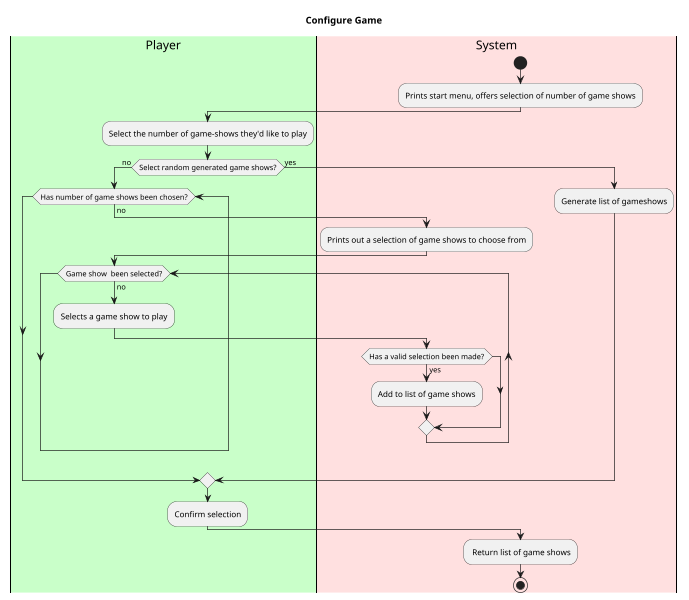

Use Case: Configure Game
=================================
**Actors**: Player, Systems

**Priority**: Medium

**Level** : User goal

**Scope**: Software system

**The Primary Actor**: User playing the game

**Purpose**: To assign the game flow based on user input

**Type**: Primary

**Preconditions**: User has opened the app

**Post-condition**: User will begin the main game flow.

**Overview**: The user decides how many rounds of game shows they'd like to play and which variations they'd like to play.
The game will begin once the desired amount of formats has been selected.

Typical course of events:
----------------------

Alternative Courses:
-----------
1. User may select and then deselect a given game show.
2. User may exit the game at any given moment
3. User may reshuffle random gameshows

