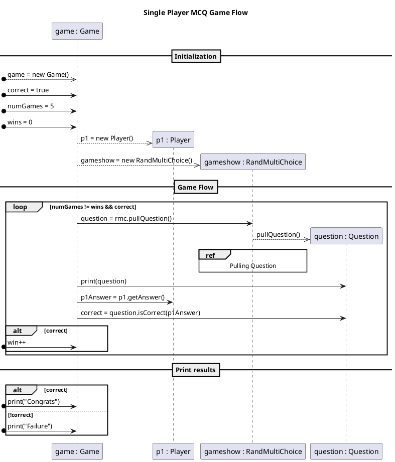
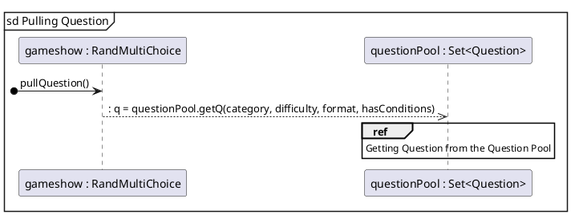
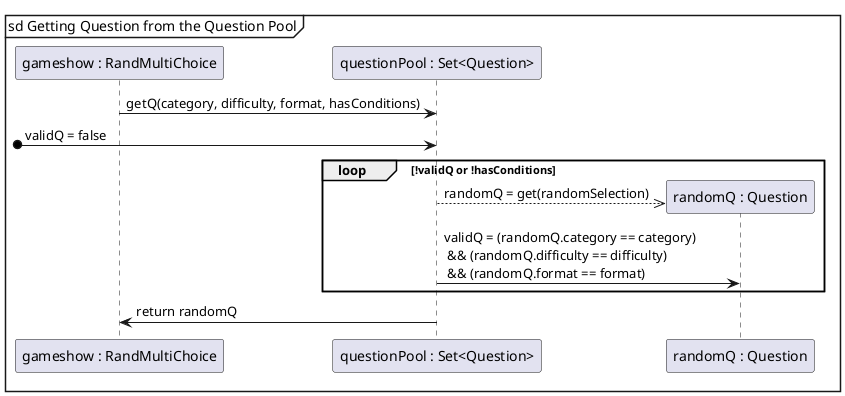

| Class           | Methods                | Fields                                                              |
|-----------------|------------------------|---------------------------------------------------------------------|
| Game            | PlaySingleGame() <br/> |                                                                     |
| Player          |                        |                                                                     |
| Question        |                        | Physical ? :: String. <br/>Choices: a, b ,c, d <br/> Correct Answer |
| Response Record |                        |                                                                     |
|                 |                        |                                                                     |
|                 |                        |                                                                     |
| Stats Record    |                        |                                                                     |   

/* Have to think about a controller, one for answering questions and processing questions, and choosing/outputting questions*/
```plantuml
title Class Diagram
' classes
'skinparam classAttributeIconSize 0 
class Game{
--
main()
playSingleGame()
answerQuestion()
}
class Question{
    -prompt: String
    -difficulty: String
    -category: String
    -questionType: String
    -choices: array[Choice]
    --
    +toString(): String
    
}
class Choice{
    -name : String
    -correct: boolean
    --
    toString(): String
}
class Player{
-name: String
-correctRecord: int
}
interface IGameShow{
--
    pullQuestion(): Question
}
Game "1" ---left-- "*" Question : "      are-contained-in     "
Question "\t1" -left-->"(1..*)" Choice:choices\n{random order, array}
Game "1\t" --right-- "1..*" Player: "      requires         "
Game "1 " -down- " 1 " IGameShow: " is-described-by"
class RandMultiChoice{
    -questionPool: Set<Question>
    --
    pullQuestion(): Question
}
IGameShow"\t   1\n\n\n\n" <|..left.."1\t" RandMultiChoice:" is-formatted-by"
RandMultiChoice "1 "--up-- " * " Question: " are-contained-in"
```





