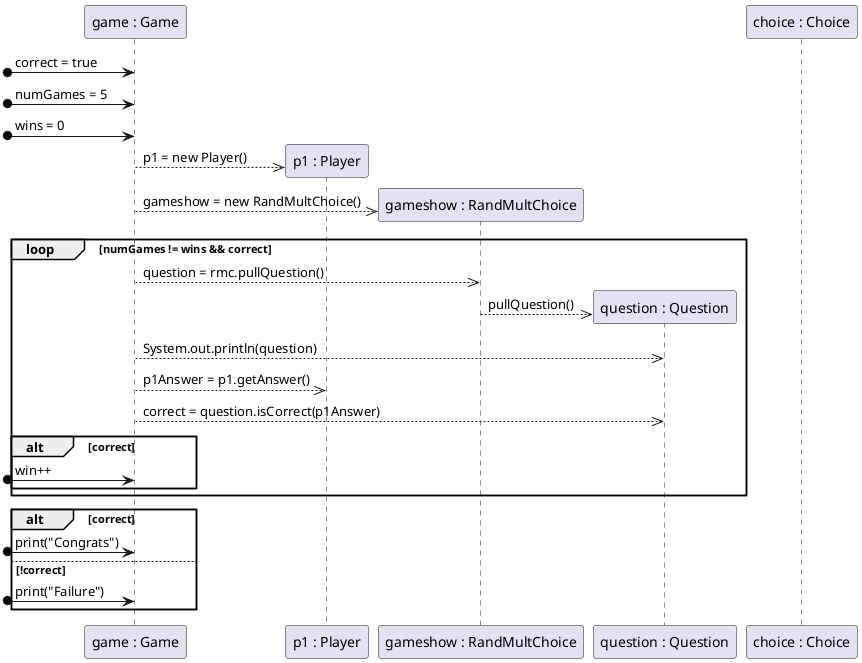

| Class           | Methods                | Fields                                                              |
|-----------------|------------------------|---------------------------------------------------------------------|
| Game            | PlaySingleGame() <br/> |                                                                     |
| Player          |                        |                                                                     |
| Question        |                        | Physical ? :: String. <br/>Choices: a, b ,c, d <br/> Correct Answer |
| Response Record |                        |                                                                     |
|                 |                        |                                                                     |
|                 |                        |                                                                     |
| Stats Record    |                        |                                                                     |   

```plantuml
' classes
class Game{
main()
playSingleGame()
answerQuestion()
}
class Question{
    prompt: String
    choices: array[Choice]
    toString(): String
    
}
class Choice{
    name : String
    correct: boolean
    toString(): String
}
class Player{
name: String
correctRecord: int
}
interface IGameShow{
    pullQuestion(): Question
}
Game "1" -- "*" Question : contains 1...*
Question -- Choice
Game -- Player
Game "1"-- " 1 " IGameShow
class RandMultChoice{
    pullQuestion(): Question
}
IGameShow -- RandMultChoice
```
