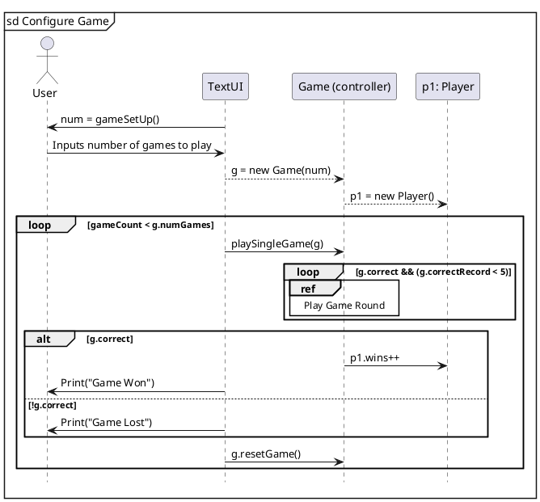
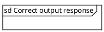

| Class           | Methods                | Fields                                                              |
|-----------------|------------------------|---------------------------------------------------------------------|
| Game            | PlaySingleGame() <br/> |                                                                     |
| Player          |                        |                                                                     |
| Question        |                        | Physical ? :: String. <br/>Choices: a, b ,c, d <br/> Correct Answer |
| Response Record |                        |                                                                     |
|                 |                        |                                                                     |
|                 |                        |                                                                     |
| Stats Record    |                        |                                                                     |   

/* Have to think about a controller, one for answering questions and processing questions, and choosing/outputting questions*/
```plantuml
title Class Diagram
' classes
'skinparam classAttributeIconSize 0 
class TextUI{
--
+main(String[] args): void
+ playSingleGame(Game g): void
+ getAnswer(): int
}
class Game{
    -numGames: int
    - correct = true: boolean
    - correctRecord = 0: int
--
    + checkAnswer(Question q, int index): String
}
class Question{
    -prompt: String
    -difficulty: String
    -category: String
    -questionType: String
    -choices: array[Choice]
    --
    +toString(): String
    +isCorrect(int selection): boolean
    
}
class Choice{
    -name : String
    -correct: boolean
    --
    +toString(): String
    +getCorrect(): boolean
}
class Player{
-name: String
-wins: int
}
interface IGameShow{
--
    getQuestion(): Question
}
Game "1" ---left-- "*" Question : "                         are-contained-in                        "
Question "\t1" -left-->"(1..*)" Choice:choices\n{random order, arrayList}
Game "1\t" --right-- "1..*" Player: "      requires         "
Game "1 " --down-- " 1 " IGameShow: " is-described-by"
class RandMultiChoice{
    -questionPool: ArrayList<Question>
    --
    +getQuestion(): Question
    +getQuestion(String category, String difficulty, String questionType): Question
}
IGameShow"\t   1\n\n\n\n" <|..left.."1\t" RandMultiChoice:"        is-formatted-by                    "
RandMultiChoice "1 "--up-- " * " Question: " are-contained-in"
Game "1" -up-- "1" TextUI: " interacts with "
```






qp -> rmc: Question Pool updated
rmc -> clr: Controller receives question