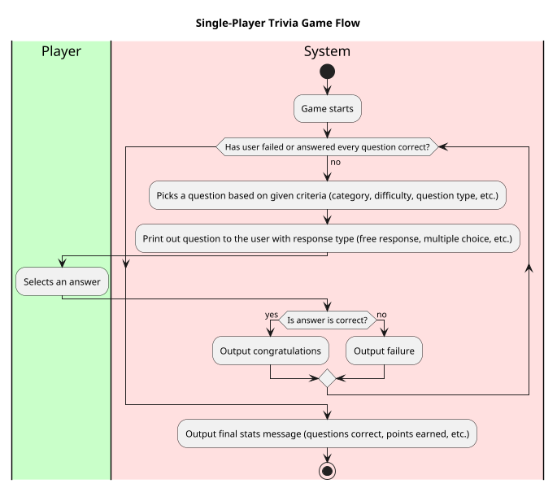
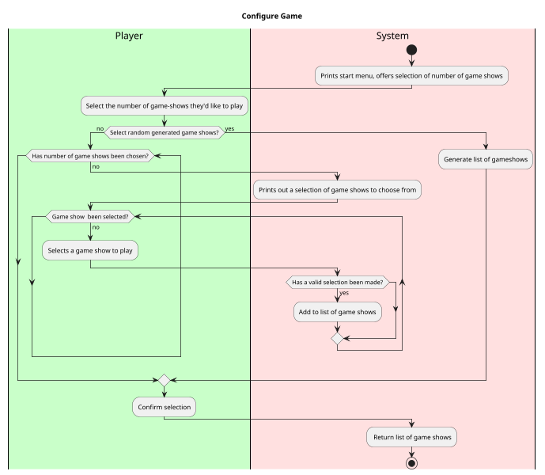
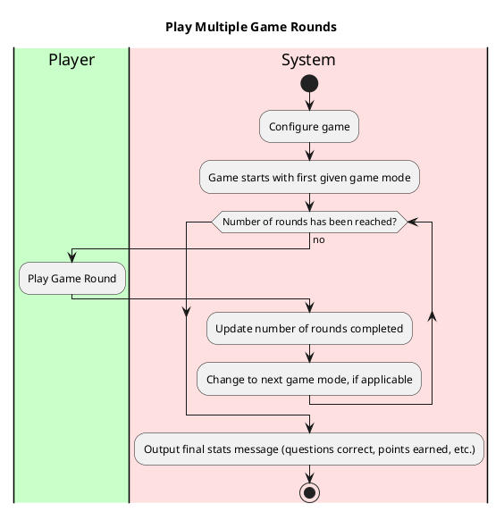

Use Case: Play Game Round
=================================
**Actors**: Player, Systems, Database

**Priority**: High

**Level** : User goal

**Scope**: Software system

**The Primary Actor**: User playing the game

**Purpose**: To play a basic round of multiple choice trivia

**Type**: Primary

**Preconditions**: User has chosen to play a standard a given trivia game.

**Post-condition**: User will have completed a game of trivia on their record.

**Overview**: Based on the type of game show, a question is selected by the system for the user to provide a response to.
This continues either until the user loses, or they answer all questions correctly.

## Typical course of events:

Alternative Courses:
-----------
1. Question may be selected based on user's decision or by random generation based on a game's format
2. User may answer free response or multiple choice
3. User may exit the game at any given moment
4. For any question, the user may select to use a hint before answering (50/50, Phone a friend, Ask the audience),
which will print onto the screen to help the user answer.

Use Case: Configure Game
=================================
**Actors**: Player, Systems

**Priority**: Medium

**Level** : User goal

**Scope**: Software system

**The Primary Actor**: User playing the game

**Purpose**: To assign the game flow based on user input

**Type**: Primary

**Preconditions**: User has opened the app

**Post-condition**: User will begin the main game flow.

**Overview**: The user decides how many rounds of game shows they'd like to play and which variations they'd like to play.
The game will begin once the desired amount of formats has been selected.

Typical course of events:
----------------------

Alternative Courses:
-----------
1. User may select and then deselect a given game show.
2. User may exit the game at any given moment
3. User may reshuffle random gameshows

Use Case: Play Multiple Game Rounds
=================================
**Actors**: Player, Systems, Database

**Priority**: High

**Level** : User goal

**Scope**: Software system

**The Primary Actor**: User playing the game

**Purpose**: To play multiple rounds of trivia games

**Type**: Primary

**Preconditions**: User has chosen to play a multiple game modes

**Post-condition**: User will have completed multiple games of trivia on their record.

**Overview**: After the game configures, the game presents multiple rounds of trivia game modes in a sequence.
After completing each round, the next game mode will be played until there is no more rounds to be played.
## Typical course of events:

Alternative Courses:
-----------
1. User may quit in the middle of the game

