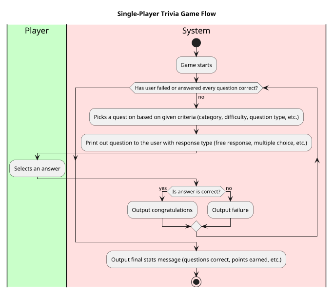
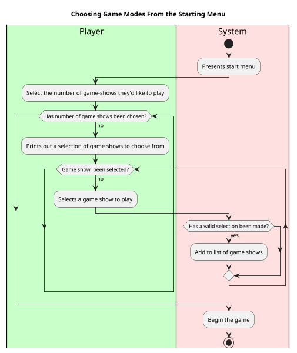

# Brief Use Cases

## Game Opens - Single Game Mode
1. Game opening screen is shown
2. Player receives multiple options of style of game to choose
3. Player's picks an option between: different styles or random
4. Player's choice is registered and single player is activated

## Game Opens - Multiple Game Mode
1. Game opening screen is shown
2. Player decides how many round they'd like to play.
3. Player receives multiple options of style of game to choose
4. Player's picks an option between: different styles or random
5. Player's choice is registered
6. Process repeats until a given number of styles have been chosen
7. Single player mode is activated

### Choosing a random game mode
1. Player chooses the random game option
2. Game uses a random generator to pick which of the available game modes to play
3. If game mode has already been selected, then try again, until three modes have
been selected

## Single Player

### Game Flow
1. Game starts
2. Player plays the game until finish conditions are met (all answered correctly, one wrong answer, etc)
3. Results are printed for the round
4. If any rounds are left, repeat process with new game style, otherwise, print final results.

### Choosing a category
1. Player receives multiple categories to answer a question from
2. Player chooses from the given category
3. Game outputs a question from the category chosen by the player

### Multiple Choice, general category
1. Print out trivia question
2. Provide answer choices
3. Player chooses their preferred answer
4. Program registers the chosen answer 
5. Program reads whether answer was correct or not.
6. If player answers, correctly the process repeats
7. If player answers incorrectly, we break out
8. If player reaches question and registers a correct response we also break out
## BreakOut
### Player breaks out due to incorrect response
1. Players' game stats are printed
2. Player then receives a game over message

### Player answers 10 questions correctly
1. Player's game stats are printed 
2. Player then receives a message of victory
3. Win is recorded on account record

## Post-Results
1. Player receives win statistics
2. Player receives option to play again

## Accessing Trivia Questions
1. Based on the given criteria (category, difficulty, question type, etc.),
search for an appropriate trivia question
2. Checks that question has not been asked in the same game session
3. Once one is found, return it to the program and display to the user

Use Case: Playing Single Player Multiple Choice Game
=================================
**Actors**: Player, Systems, Database

**Priority**: High

**Level** : User goal

**Scope**: Software system

**The Primary Actor**: User playing the game

**Purpose**: To play a basic round of multiple choice trivia

**Type**: Primary

**Preconditions**: User has chosen to play a standard a given trivia game.

**Post-condition**: User will have completed a game of trivia on their record.

**Overview**: Based on the type of game show, a question is selected by the system for the user to provide a response to.
This continues either until the user loses, or they answer all questions correctly.

## Typical course of events:

Alternative Courses:
-----------
1. Question may be selected based on user's decision or by random generation based on a game's format
2. User may answer free response or multiple choice
3. User may exit the game at any given moment
4. 

Use Case: Choosing Game Modes From the Starting Menu
=================================
**Actors**: Player, Systems

**Priority**: Medium

**Level** : User goal

**Scope**: Software system

**The Primary Actor**: User playing the game

**Purpose**: To assign the game flow based on user input

**Type**: Primary

**Preconditions**: User has opened the app

**Post-condition**: User will begin the main game flow.

**Overview**: The user decides how many rounds of game shows they'd like to play and which variations they'd like to play.
The game will begin once the desired amount of formats has been selected.

Typical course of events:
----------------------

Alternative Courses:
-----------
1. User may select and then deselect a given game show.
2. User may exit the game at any given moment
