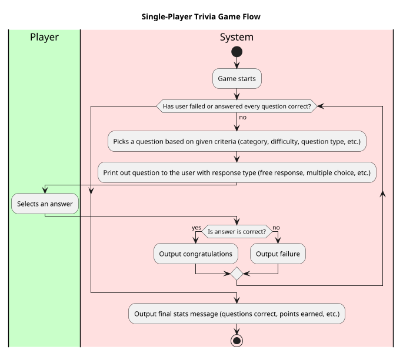
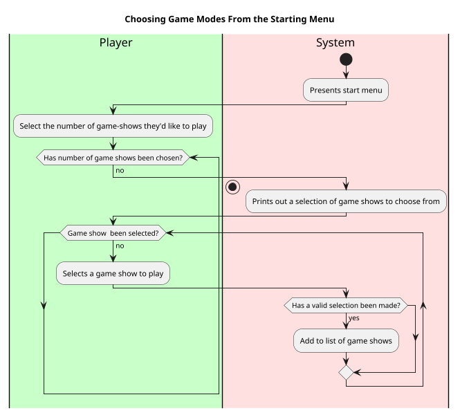

# Brief Use Cases

## Configure Game
1. Game opening screen is shown
2. Player decides how many round they'd like to play
3. System outputs receives multiple options of style of game to choose
4. Player's picks an option between: choose styles or random
5. If random, system selects a random set of the available game modes, otherwise
user chooses until they have a valid number of modes selected
6. System registers user's choice and single player is activated

### Play Game Round
1.

## Single Player

### Play Multiple Game ROunds
1. Configure game
2. Game starts
2. Player plays a game round until end conditions are met (all answered correctly, one wrong answer, etc)
3. Results are printed for the round
4. If any rounds are left, repeat process with new game style, otherwise, print final results.

### Play Game Round
1. Game starts
2. System selects and outputs a question based on given criteria
3. Player selects an answer
4. System register answer and compares to correct answer
4. If answer is correct, System outputs congratulation, otherwise outputs failure
5. Repeat until given number of questions have been answered without failure, or 
one question has been answered incorrectly
6. Output final stats message (questions correct, points earned, etc.)

Use Case: Playing Single Player Multiple Choice Game
=================================
**Actors**: Player, Systems, Database

**Priority**: High

**Level** : User goal

**Scope**: Software system

**The Primary Actor**: User playing the game

**Purpose**: To play a basic round of multiple choice trivia

**Type**: Primary

**Preconditions**: User has chosen to play a standard a given trivia game.

**Post-condition**: User will have completed a game of trivia on their record.

**Overview**: Based on the type of game show, a question is selected by the system for the user to provide a response to.
This continues either until the user loses, or they answer all questions correctly.

## Typical course of events:

Alternative Courses:
-----------
1. Question may be selected based on user's decision or by random generation based on a game's format
2. User may answer free response or multiple choice
3. User may exit the game at any given moment
4. For any question,

Use Case: Choosing Game Modes From the Starting Menu
=================================
**Actors**: Player, Systems

**Priority**: Medium

**Level** : User goal

**Scope**: Software system

**The Primary Actor**: User playing the game

**Purpose**: To assign the game flow based on user input

**Type**: Primary

**Preconditions**: User has opened the app

**Post-condition**: User will begin the main game flow.

**Overview**: The user decides how many rounds of game shows they'd like to play and which variations they'd like to play.
The game will begin once the desired amount of formats has been selected.

Typical course of events:
----------------------

"system presents available game styles", 
"user selects styles they want", 
"system validates selection not empty, outputs error and asks to try again, 
otherwise records selection, the end."
Alternative Courses:
-----------
1. User may select and then deselect a given game show.
2. User may exit the game at any given moment
