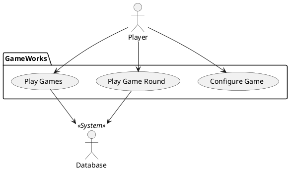

# Vision Document
## Target Audience
Anyone generally interested in trivia-styled games. The value of the game
is educational entertainment. This app is designed to keep the audience
entertained by asking them unique questions from a wide range of categories.
## Main Features
A player will be able to open the app and make an option between various game
styles. Our first priority is to develop a single-player game in which a
player can easily choose between various multiple-choice options.
With good progress, we plan to expand or idea to a 2-player mode and/or a
player v. CPU mode, potentially using ChatGPT. We also plan to incorporate
different game-show formats and the player will be provided with an option
to chose between any of them or chose a random set.

We also plan on creating a reward structure, in which players can earn some
kind of currency where they will be able to purchase game benefits, such as
hints or helpers.

## Constraints
Our largest difficulty will be implementing all of our ideas. Time will limit
our chances of everything being able to incorporated, this is why we want to
guarantee that the game works with the single-player mode.

Another constraint will be the source of trivia questions, in which we will
need to put in various questions into our trivia game. This means that we will
either have to implement them ourselves or find a database that we can insert
questions from.

## Actor Goal List

| Player             | Database          |
|--------------------|-------------------|
| Configure Game     | Store question    |
| Answer Question    | Retrieve question |
| Breakout from Game | Prevent repeats   |

