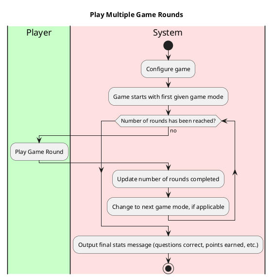

Use Case: Play Multiple Game Rounds
=================================
**Actors**: Player, Systems, Database

**Priority**: High

**Level** : User goal

**Scope**: Software system

**The Primary Actor**: User playing the game

**Purpose**: To play multiple rounds of trivia games

**Type**: Primary

**Preconditions**: User has chosen to play a multiple game modes

**Post-condition**: User will have completed multiple games of trivia on their record.

**Overview**: After the game configures, the game presents multiple rounds of trivia game modes in a sequence.
After completing each round, the next game mode will be played until there is no more rounds to be played.
## Typical course of events:

Alternative Courses:
-----------
1. User may quit in the middle of the game